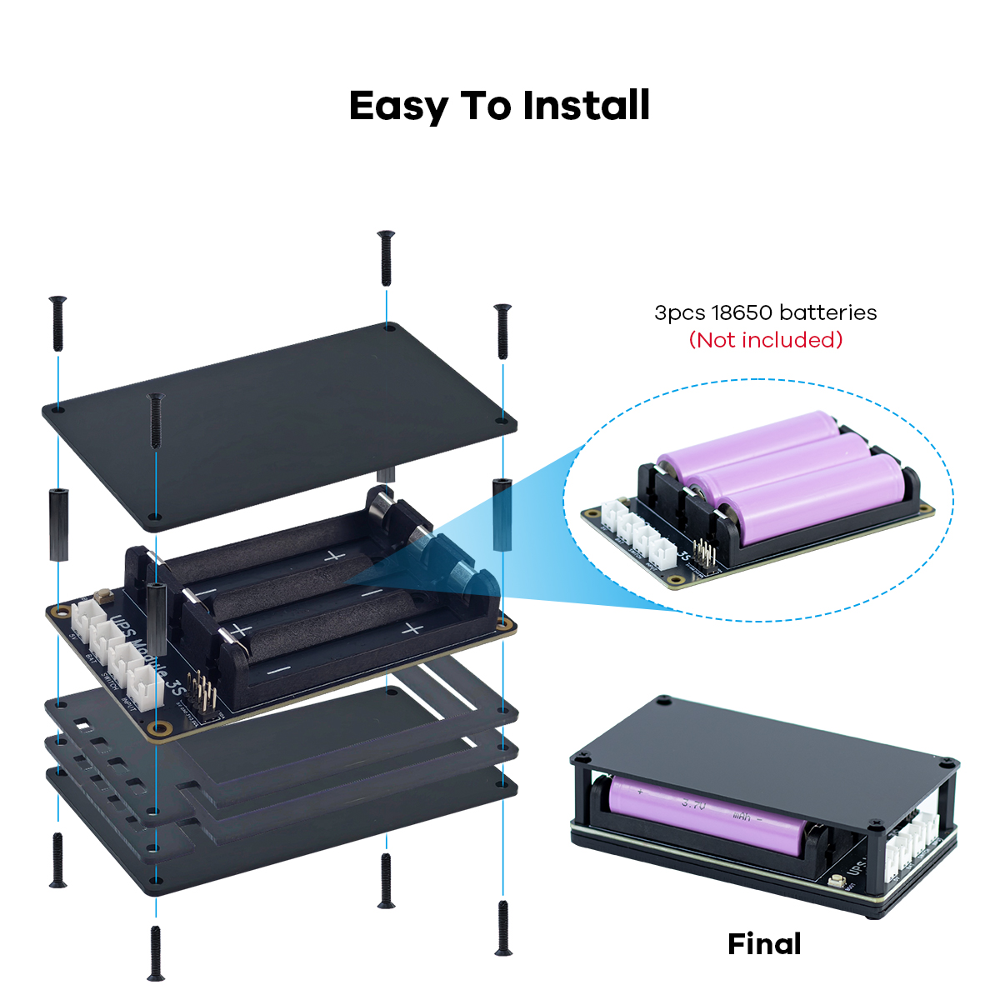
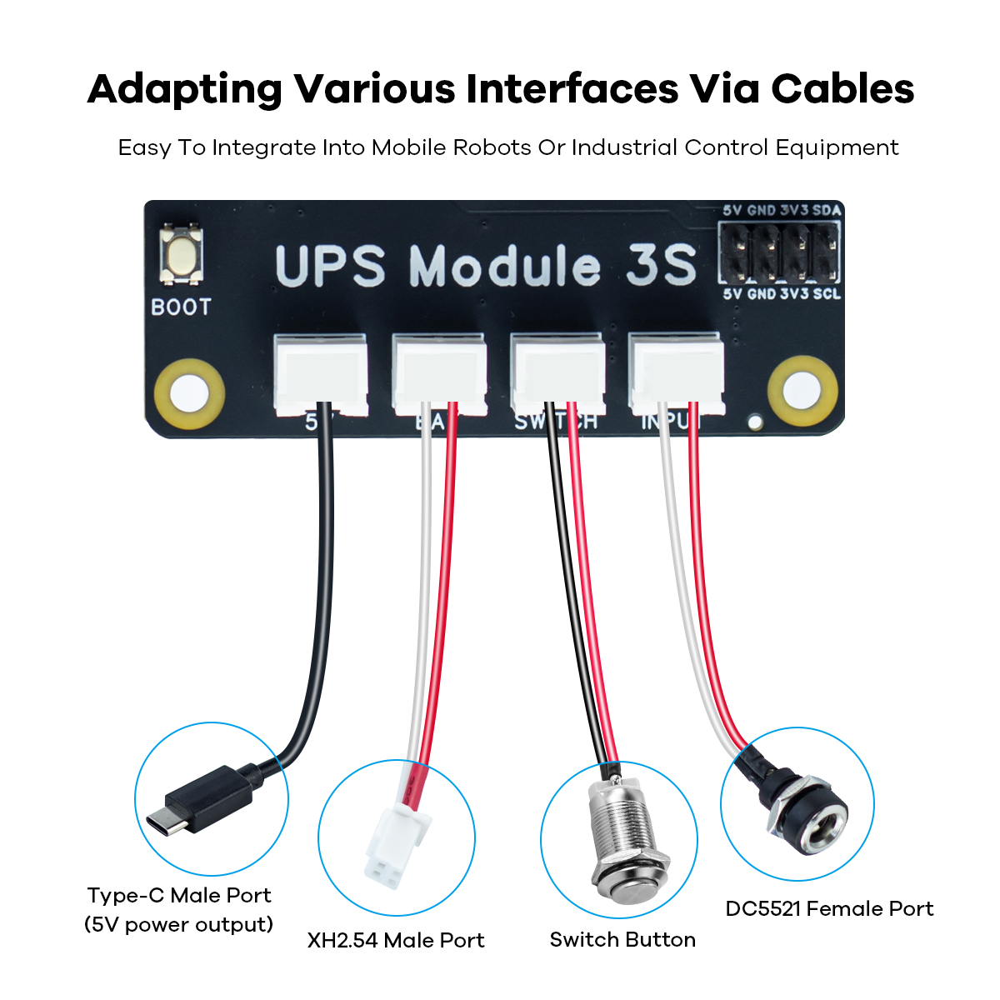

.. __Assembly:

Assembly
==========================

.. tip::

   It is recommended to install the acrylic cover before use.  
   It prevents short circuits between the bottom circuitry and nearby objects and also secures the batteries in place.

.. note::

   If you plan to use I²C communication (e.g., power monitoring) or any other external functions, connect the corresponding wires to the multifunction expansion pins **according to the silkscreen labels(5V 3V3 GND SDA SCL)** before installing the acrylic cover.

.. note::

   These four wires should also be connected **before** the acrylic cover is installed.