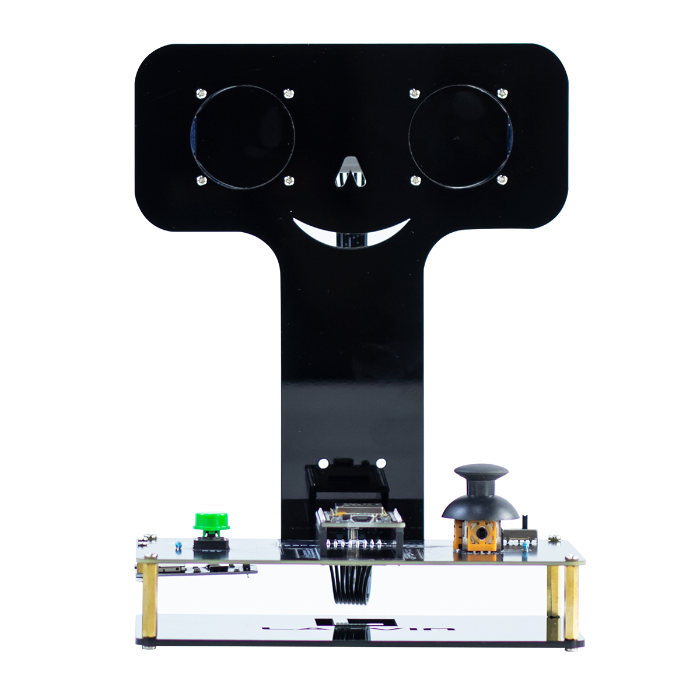
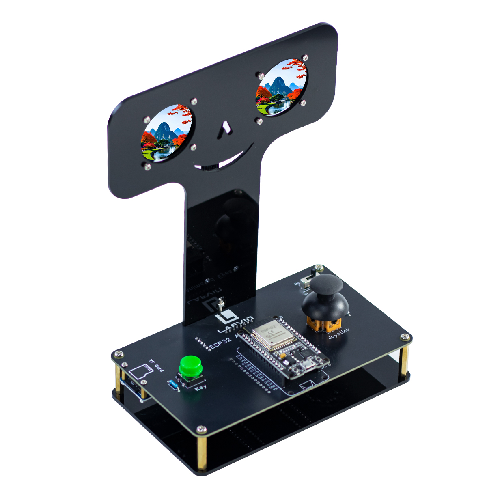

.. __about_this_kit:

About_this_kit
====================

Preface
-------------------------------

Before we understand the UPS Module 3S,we need to first understand it.The following figure is a schematic diagram of the 
UPS Module 3S:

   

Componen List
-------------------------------

1.ESP32-DEVKIT-V1 Board x1

2.ESP32-Animated Eyes  Board x1

3.TF-Card-Adapter x1

4.GC9A01 1.28 inch TFT x2

5.TFT Breakout Board x1

6.TF Card Reader x1

7.TF Card x1

8.XH2.54 8P 30 cm Cable x1

9.Micro USB Cable x1

10.Acrylic Plates x2

11.Screw Set x1

12.Phillips screwdriver x1

   .. image:: /Tutorial/img/LA065_A9_V2.jpg
