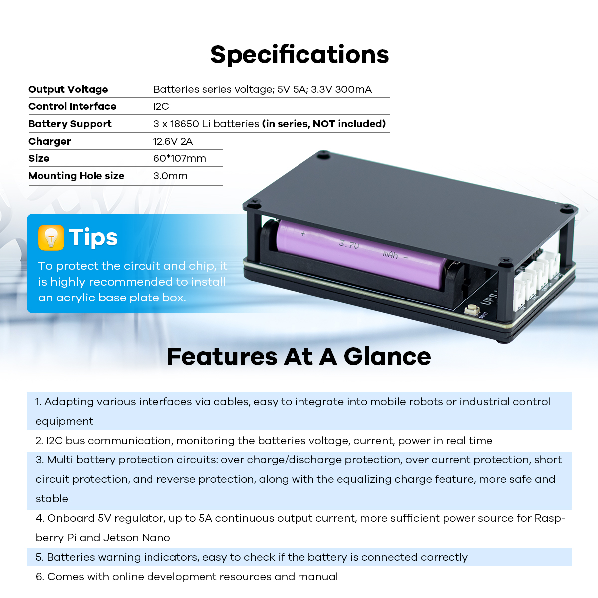
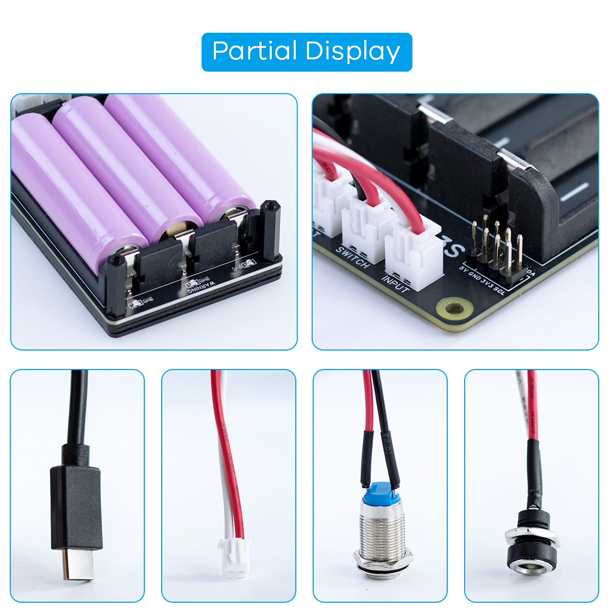

.. __about_this_kit:

About_this_kit
====================

Preface
-------------------------------

We first need to understand what an UPS Module 3S is. The illustration below shows an UPS Module 3S.

   

Componen List
-------------------------------

1. UPS Module 3S x1
2. Type-C to XH2.54 Terminal Cable x1
3. Dual-Head Reverse XH2.54mm Terminal Cable x1
4. 12MM Self-Locking Switch to XH2.54mm x1
5. DC5521 Female Connector Charging Port to XH2.54mm x1
6. 12.6V 2A Power Adapter x1
7. Acrylic Board x4
8. Screw Pack x1
9. Cross Screwdriver x1

   .. image:: /Tutorial/img/LB004_A1_V3.jpg
