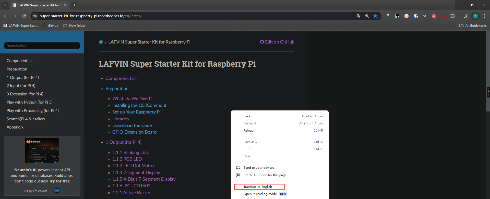
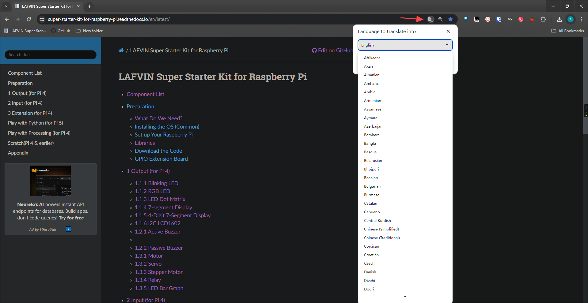
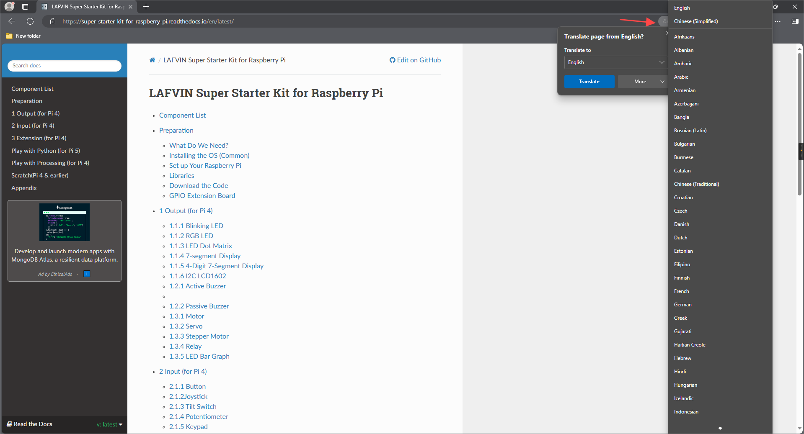
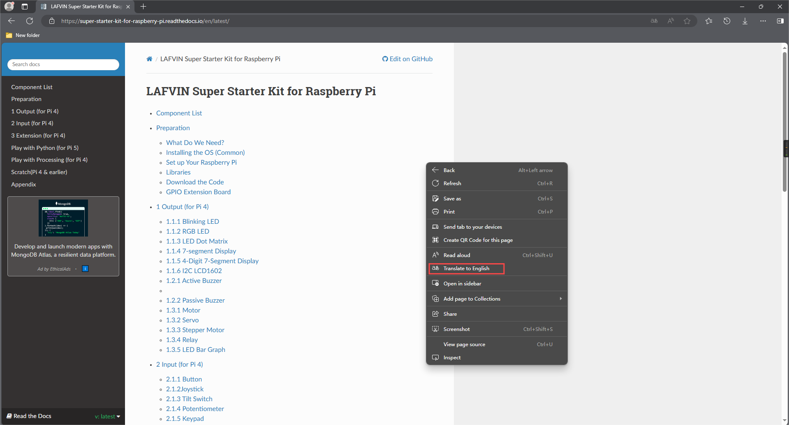

**Translate**
=============

If your mother tongue is beyond English, you can use the "translation" function that comes with the browser, and then demonstrate how to use the translation function of Chrome and Edge

If you're using Chrome, you can **right-click on the page and select Translate**, or **click the Translate icon in the address bar.**

Then choose the language you want to translate

If you're using Edge, you can **right-click on the page and select Translate**, or **click the Translate icon in the address bar**.

Then choose the language you want to translate

